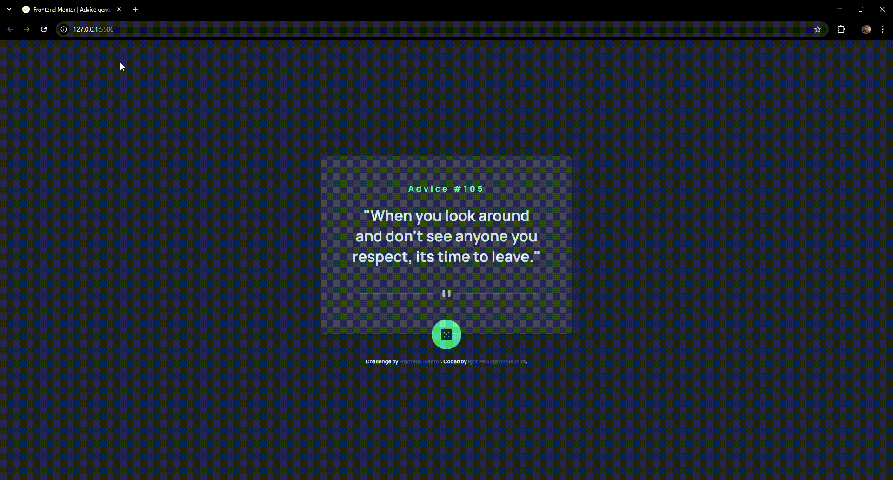

# 💬 Advice Generator App

Este projeto é um aplicativo web simples que gera conselhos aleatórios consumindo dados da [Advice Slip API](https://api.adviceslip.com/). Desenvolvido como parte de um desafio da Frontend Mentor.

## 📸 Preview



---

## 📁 Estrutura de pastas
src/
├── CSS/
│ ├── reset.css
│ ├── styles.css
│ ├── variables.css
│ └── responsive.css
├── JS/
│ └── index.js
├── images/
│ ├── favicon-32x32.png
│ ├── icon-dice.svg
│ ├── pattern-divider-desktop.svg
│ └── pattern-divider-mobile.svg
index.html

---

## 🧪 Funcionalidades

- Gera conselhos aleatórios via API.
- Layout responsivo para mobile e desktop.
- Estilizado com CSS modular e variáveis customizadas.
- Efeitos visuais ao clicar no botão.

---

## 🛠️ Tecnologias

- HTML5
- CSS3 (com variáveis e media queries)
- JavaScript Vanilla (ES6+)
- [Advice Slip API](https://api.adviceslip.com/)

---

## 🚀 Como usar

### 1. Clone o repositório

```bash
git clone https://github.com/seu-usuario/advice-generator-app.git
cd advice-generator-app
```

### 2. Abra o arquivo index.html no navegador
Você pode usar uma extensão como Live Server no VS Code ou simplesmente abrir o arquivo no navegador:
```bash
# exemplo (em sistemas Unix):
xdg-open index.html
```

🔧 Estrutura do Código
index.html: Estrutura básica da interface.

styles.css: Estilo principal da aplicação.

variables.css: Variáveis de cores e fontes.

responsive.css: Estilos responsivos (media queries).

index.js: Lógica JS para carregar e exibir conselhos dinamicamente.

##  ✨ Desafio
Este projeto foi desenvolvido com base no desafio da Frontend Mentor:

Gere conselhos aleatórios com um clique, aplicando boas práticas de responsividade, acessibilidade e código modular.

##  👨‍💻 Autor
Igor Peixoto de Oliveira

GitHub: @IgorPeixotoOliveira

LinkedIn: [Seu Perfil](https://www.linkedin.com/in/igor-peixoto-de-oliveira/)

---
